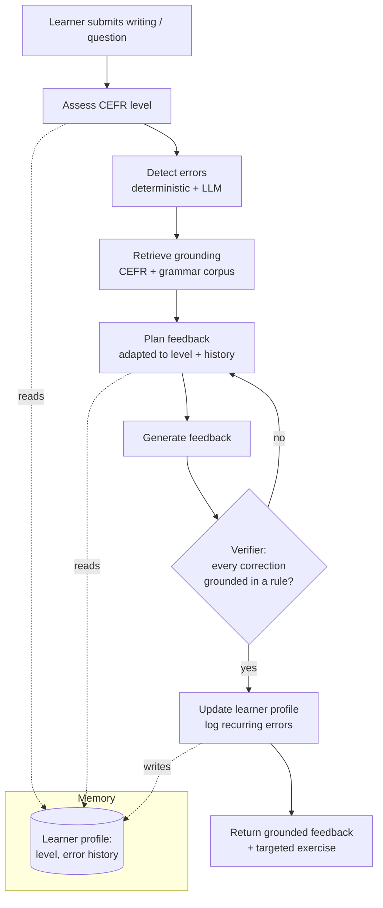

# Parla — an evaluation-driven agentic English writing tutor

> An agentic writing-feedback system that grounds every correction in real pedagogical
> references (CEFR + grammar corpus), adapts to each learner's level, and is benchmarked
> on standard Grammatical Error Correction datasets — not vibes.

<!--
  ┌──────────────────────────────────────────────────────────────────────────┐
  │  BADGE ROW — wire these up once CI + demo are live. They are the first     │
  │  thing a recruiter's eye lands on. A GREEN ci badge on a junior repo is    │
  │  rarer than it should be, so make sure it passes.                          │
  └──────────────────────────────────────────────────────────────────────────┘
-->


[](YOUR_HF_SPACES_URL)

<!--
  DEMO GIF GOES HERE, ABOVE EVERYTHING ELSE. 20–30 seconds of one genuinely
  multi-step interaction: learner submits a paragraph, you watch the agent
  detect errors, retrieve a rule, give grounded feedback, and log the error.
  Record with a screen recorder, convert to GIF, drop it in docs/demo.gif.
-->


**Live demo:** YOUR_HF_SPACES_URL  ·  **2-min walkthrough:** YOUR_LOOM_URL

---

## Why this exists

Most LLM writing tutors do one thing: paste the essay into a prompt and hope. That
produces confident, ungrounded, often *wrong* grammar advice — the exact failure mode a
language learner can't detect. Parla treats feedback as an engineering problem: detect
errors with a deterministic signal, **retrieve the actual rule**, generate feedback the
model must ground in that rule, and **verify** it before the learner ever sees it.

It is currently used by **XX learners at a live English school**, and it is measured
against the same benchmarks NLP researchers use.

## Headline results

<!--
  ⚠️  THESE ARE PLACEHOLDERS. Do NOT publish until you have run the eval harness
      and replaced every XX with a real number. Fabricated benchmark numbers are
      the fastest way to fail a technical screen. Keep the baseline column — it is
      what proves the agent earns its complexity.
-->

| Metric                                    | Single-shot LLM (baseline) | Parla (agentic) |
|-------------------------------------------|:--------------------------:|:---------------:|
| GEC F0.5 (BEA-2019 dev, ERRANT scorer)    |            XX.X            |      XX.X       |
| Error-detection precision                 |            XX.X            |      XX.X       |
| Feedback faithfulness (grounded-in-rule)  |            XX%             |      XX%        |
| CEFR level-assessment accuracy            |            XX%             |      XX%        |
| Avg. cost / interaction                   |          $0.00XX          |     $0.00XX     |
| Avg. latency / interaction                |            X.Xs           |      X.Xs       |

> Read the full methodology, dataset choices, and honest analysis (including where the
> agent *loses* to the baseline) in [`docs/evaluation.md`](docs/evaluation.md).

## Architecture



## Tech stack

- **Orchestration:** LangGraph (stateful graph, conditional retry edge, checkpointing)
- **Toolkit:** LangChain (tools, retrievers, model wrappers)
- **Retrieval:** ChromaDB · hybrid dense + BM25 · sentence-transformers · reranker
- **LLM APIs:** provider-agnostic (Groq / OpenAI / Anthropic) via a thin router
- **Memory:** per-learner profile store (recurring errors, level trajectory)
- **Evaluation:** ERRANT / M2 scorer on BEA-2019 & CoNLL-2014 · RAGAS · LLM-as-judge
- **Observability:** LangSmith (or Langfuse) tracing
- **App:** Streamlit demo · FastAPI backend
- **Engineering:** pytest · GitHub Actions CI · Docker · typed, pydantic-settings config

## Quickstart

```bash
git clone https://github.com/Mj-myhub/parla.git
cd parla
cp .env.example .env          # add your API keys
pip install -e ".[dev]"
python -m parla.retrieval.index --build   # build the grammar/CEFR index
streamlit run src/parla/app/streamlit_app.py
```

## Run the evaluation

```bash
python -m parla.eval.run_eval --dataset bea2019-dev --compare-baseline
# writes a report + plots to eval/reports/
```

## Limitations & next steps

<!-- Keep this section. An honest limitations section reads as MORE senior, not less. -->
- GEC coverage is strongest on the error types present in the training corpus; rare
  register/pragmatics errors are under-covered.
- The verifier reduces but does not eliminate ungrounded corrections; residual rate is
  reported in `docs/evaluation.md`.
- Next: expand the pedagogical corpus; add speaking/pronunciation feedback; expose tools
  over MCP for reuse by other agents.

## License

MIT
