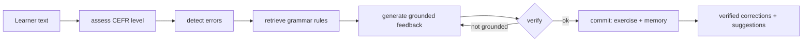

# Parla — an evaluation-driven agentic English writing tutor

> Parla gives English learners grammar feedback that is **grounded in a real rule** and
> **honest about its own confidence**: every correction is either verified against a
> curated grammar rule or clearly flagged as an unverified suggestion. It is built as a
> LangGraph agent and measured on real, hand-annotated learner writing.


*Built by a computational linguist. The point of this project is not a flawless grammar
checker — it is a system that knows what it does and doesn't know, and proves it with
numbers.*

---

## What it does

A learner pastes a piece of writing. Parla:

1. **assesses** the learner's CEFR level,
2. **detects** errors with a hybrid pipeline (rules + spaCy + LLM),
3. **retrieves** the relevant grammar rule for each error from a CEFR-tagged corpus,
4. **generates** level-appropriate feedback grounded in those rules,
5. **verifies** each correction with a two-tier check, and
6. **remembers** the learner's recurring errors across sessions.

Corrections that pass verification are shown as **✅ verified**; everything else is shown
as a **💡 suggestion** — never dressed up as a rule. That honesty is the core design idea.

## Architecture



### Hybrid error detection (precision + recall)
- **Layer 1 — deterministic rules** (a/an, no model needed): high precision, zero deps.
- **Layer 2 — spaCy morphosyntax**: subject-verb and noun-number agreement, written
  against observed `en_core_web_sm` tags.
- **Layer 3 — LLM (Groq/Llama)**: recall for the long tail (tense, prepositions, style),
  with grammar vs. style separated at the source.

### Two-tier grounding verifier (the guardrail)
- **Tier 1 (deterministic):** a correction is grounded only if it cites a rule that was
  actually retrieved *and* whose type matches the error.
- **Tier 2 (LLM faithfulness judge):** confirms the cited rule genuinely *explains* the
  fix — catching type-consistent but semantically wrong groundings.

So "verified" means *grounded in a rule that truly explains the correction* — a precise,
defensible claim, not a decorative badge.

## Evaluation

Measured on a small **held-out set of hand-annotated learner sentences** (12 sentences,
14 gold edits: a mix of real B2 IELTS essay text and elementary-error sentences), scored
at the edit level. `EXACT` requires character-for-character span match; `OVERLAP` credits
a detection whose span overlaps the gold error region (wording-agnostic).

| config | scorer | precision | recall | F0.5 |
|---|---|---|---|---|
| deterministic | exact / overlap | **1.00** | 0.57 | 0.87 |
| det + LLM | overlap | 0.65 | **0.93** | 0.69 |
| det + LLM | exact | 0.40 | 0.57 | 0.43 |

**Reading it:** the deterministic layer has **perfect precision** (zero false positives) on
the errors it covers; adding the LLM lifts recall from 0.57 to **0.93** — it finds almost
everything — at a precision cost (0.65), because it over-flags. That precision/recall
tradeoff is exactly the point, and it is quantified rather than asserted.

Reproduce with:
```bash
python -m parla.eval.scored_eval
```

**Honest caveats (also in the roadmap):** this is a small, illustrative sample, not a
statistically powerful benchmark. `OVERLAP` is more lenient than the standard GEC scorer —
**ERRANT** integration (for a published-comparable correction score) and a
**judge-agreement study** (validating the Tier-2 judge against human labels) are the next
steps.


### Standard scorer (ERRANT)

Scored with **ERRANT**, the field-standard GEC scorer, on the same annotated set.
`detection` = found the error span; `correction` = also produced the right fix.

| config | metric | precision | recall | F0.5 |
|---|---|---|---|---|
| deterministic | detection / correction | **1.00** | 0.57 | 0.87 |
| det + LLM | detection / correction | 0.48 | 0.71 | 0.51 |

For the deterministic layer, detection and correction scores are **identical** — when the
rules fire, they don't just locate the error, they fix it correctly. ERRANT's recall (0.71)
is lower than the overlap scorer's (0.93) because ERRANT re-tokenises and re-aligns every
sentence, so the LLM's long phrasal rewrites get split into several edits that don't line
up one-to-one with the gold annotation. Overlap is lenient; ERRANT is strict and
standard-comparable — the two together bound the system's real performance.


## Tech stack

LangGraph (orchestration) · LangChain · ChromaDB / BM25 retrieval · spaCy · Groq (Llama)
LLM · pydantic-settings · Streamlit · pytest + GitHub Actions CI · Docker.

## Quickstart

```bash
git clone https://github.com/Mj-myhub/parla.git && cd parla
python3 -m venv .venv && source .venv/bin/activate
pip install -e ".[dev]"
python -m spacy download en_core_web_sm
cp .env.example .env            # add GROQ_API_KEY
pytest -q                       # run the test suite
streamlit run src/parla/app/streamlit_app.py
```

## Roadmap

- Judge-agreement study: measure the Tier-2 faithfulness judge against human labels.
- Grow the CEFR grammar corpus to raise the verified-grounding rate.
- Public demo (Hugging Face Spaces) and a short walkthrough.
- Real deployment with learners at a live English school.

## License

MIT
